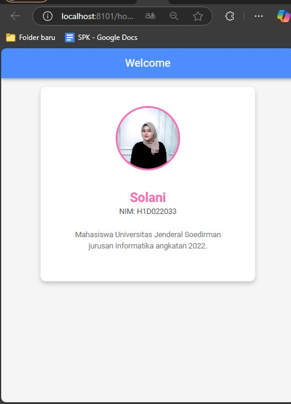

# PrakMobile_Pert7

 Nama  : SOLANI
 NIM   : H1D022033

## Screenshot

## Deskripsi
Proyek ini merupakan contoh penggunaan komponen `ion-card` pada halaman utama aplikasi Ionic untuk menampilkan nama dan NIM secara kreatif.

### Komponen yang Digunakan
Komponen `ion-card` digunakan untuk menampilkan informasi pengguna.

### Cara Menambahkan Komponen di Halaman Ionic
1. **Edit File HTML** - Buka file `src/app/home/home.page.html`.
2. **Tambahkan Komponen** - Gunakan tag `<ion-card>` untuk menambahkan informasi Nama dan NIM di halaman utama.
3. **Jalankan Proyek** - Gunakan perintah `ionic serve` untuk melihat hasilnya.

